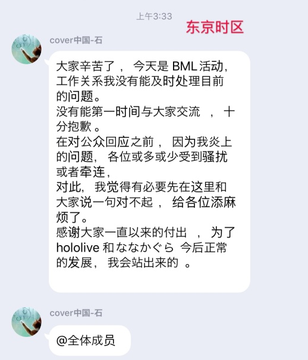
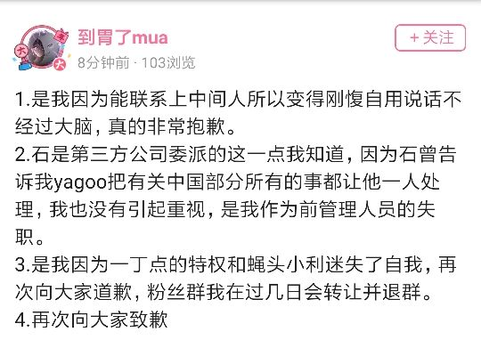
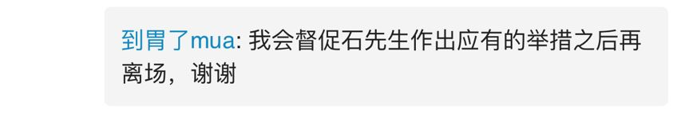
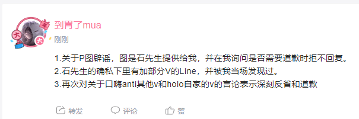
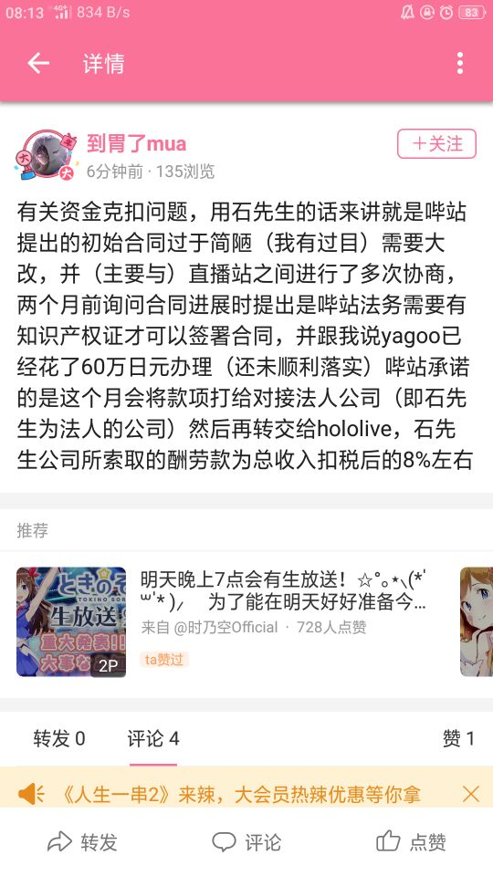
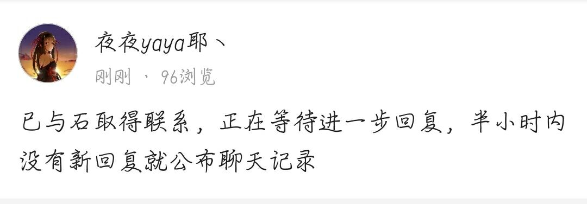
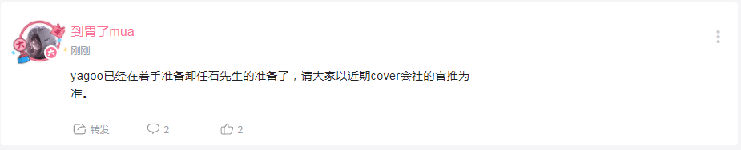

# Hololive与中方对接人员 石先生 部分言行及相关资料整理
## 中国Hololive旗下全体VTB粉丝联名信已公开，原件(中文版和日文版)已授权上传
[Bilibili动态](https://www.bilibili.com/read/cv3120762)

[推特动态](https://twitter.com/kiryubatora/status/1152545842273800192)

希望大家多多扩散，点赞转推或分享专栏给自己的友人等

## 前言

此事持续跟进，石头人必死

您未有亵渎生命的艺术的想法吗？石先生

现在加line骚扰，下次是不是就直接性骚扰中之人了？

骚扰中之人违背了这个圈子最基本的公理，龌龊而恶臭的恋童发言更是违背常伦，违背法律，而居然把一场人为纵火，造成了34条生命的消逝，34个家庭的破碎，无数珍贵的艺术作品原稿损毁，把这样一场灾难当成儿戏，当成自己口嗨的点更是人神共愤。

石先生啊，人终究会有躺进棺材的哪一天的，希望那天你不会被无数人像那天你口嗨的那样给你口嗨回来。

## 前情提要

之前网上爆出hololive中国区运营石某口嗨京阿尼火灾的聊天截图，后胃某抛出辟谣的截图，而后被证实为P图，nga在等待石某的道歉的同时，越来越多的事情被挖出。其中包括vtb在Bilibili的收益竟然卡住了7个月之久使事件进一步升级，后来更是被爆出起恋童癖的龌龊发言，以及口嗨骚扰vtb赤井心和夏色祭的中之人(是单纯口嗨还是事实没有实锤，但是据胃某提供的说法石某确实私下偷偷加中之人的line)等引发了更大规模的怒火，昨日午夜幻夜字幕组全体宣布罢工，停止对holo中国进行支持，事件全面爆发。

(所有相关发言截图已整理,已上传口嗨京阿尼火灾事件的石锤视频素材)

## 目前事态发展

1、石某短暂出现，向字幕组“致歉”

2、夜夜宣布幻夜字幕组事情解决后解散，各组独立存在

3、胃某道歉并声称会要求石某解释

4、胃某发布了收益资金相关的B博(已上传至相关后续)(8%石头税)

5、推特发布道歉。(您未亵渎nm呢？)(已上传至相关后续)

6、胃某说B站承诺提前打款(已上传至相关后续)

7、夜夜疑似与石某取得联系，如果半小时内不回复将公开聊天记录。(已上传至相关后续)

8、石某推特简介突然删除。(前后对比已上传至推特简介变动)

9、夜夜发布了一条附带视频的动态，让群众判断其是否真实跳反，同时发布了一条疑似有新的视频的动态。(动态截图和视频文件已上传至相关后续)(再次发布新动态)

[视频链接](https://vc.bilibili.com/video/2362330)

10、胃某发布COVER近期卸任石某的消息(相关截图已上传至相关后续)

## 以下为石先生相关账号等

| | |
|----|-----|
| QQ | 79749153|
| 推特 | [https://twitter.com/Luz_non @Luz_non]|
| 推特| [https://twitter.com/xxSIIxx @xxSIIxx]|
| Line | intoblue00|
| 脸书 | [https://www.facebook.com/weibin.shi/about 石巍斌]
| 领英 | [https://www.linkedin.com/in/巍斌-石-a53202134 石巍斌 (Seki Gihin)]|
| 喜马拉雅 | [https://www.ximalaya.com/zhubo/8316159 intoblue00]|
| Pixiv | [https://www.pixiv.net/member.php?id=743489 いしなぎ@夜更かし]|
| Youtube | [https://www.youtube.com/channel/UC_WZpUuDJsrQBk8pSYWpDVg 石巍斌]|
| Bilibili | [https://space.bilibili.com/412149 ishinagi]|
| Niconico.jp | [https://www.nicovideo.jp/user/7179452 石凪さん]|

待续

## 以下为爽哥在nga发表的总结(侵删)

就昨晚半夜我还在参与处理猴区京阿尼的高楼的时候看到管理群里有人问这个算无关帖吗，删了行不行

我看了眼说先工作人员也算代表企业形象，不算无关了，先放着别删，谁知道然后一夜变天种了个瓜田出来。现在更是烧出了个新八王之乱

与其说这是蝴蝶效应，不如说是某些人德不配位，咎由自取。

当然还有个根源还是holo这草台班子的管理制度令人啼笑皆非，一个中国区，业务人事财务总监等等所有权限都在一个人身上，你是同人社团吗？

所以说这瓜一直长在那，只是没想到以这么戏剧性的形式被挖了出来。

石某人私德有亏，运营操作也诸多谜团，VTB毕竟也是一份职业，认真工作的人在近半年里没有得到合理的报酬，这是无法接受的。

我不清楚cover社接下来的动作，但我只想说观众自会用脚投票，人是有同理心的，在得知背后是这么一堆狗屁倒灶的事情后，我已没有兴趣来观看你们策划的B限。
